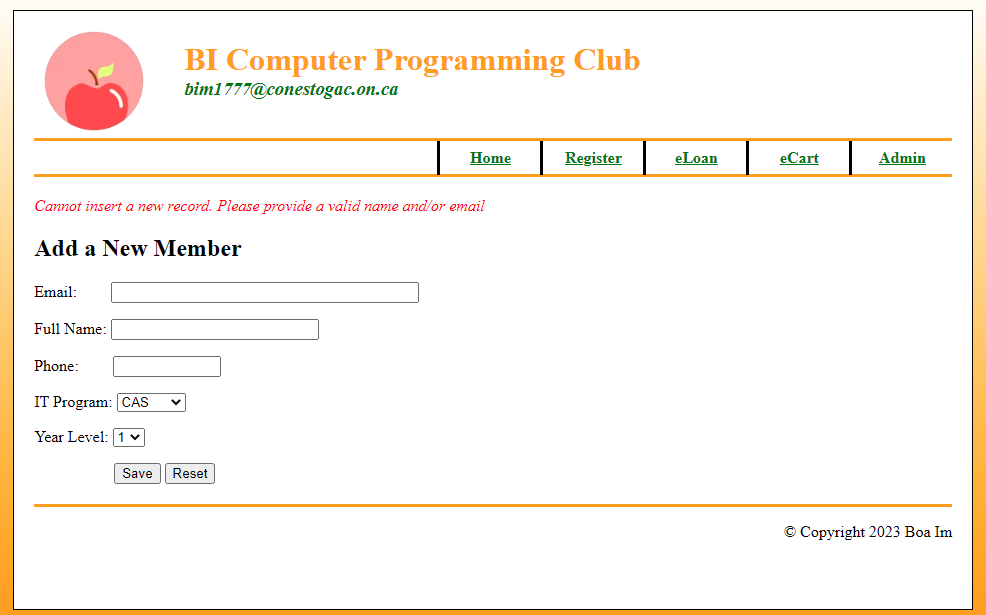
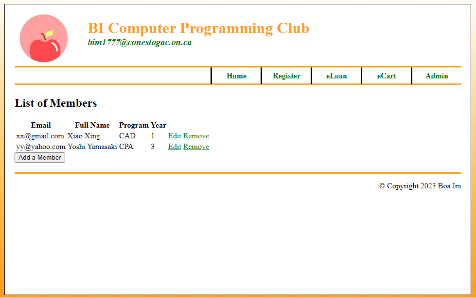
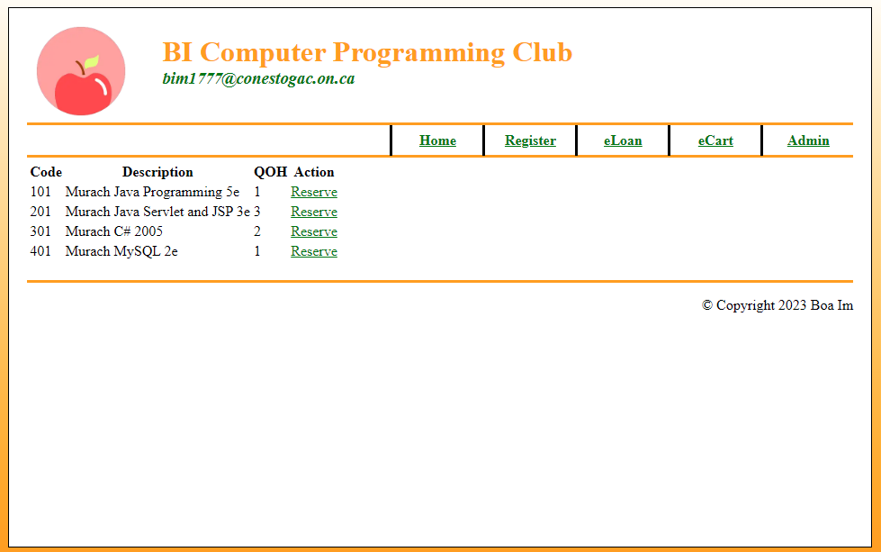
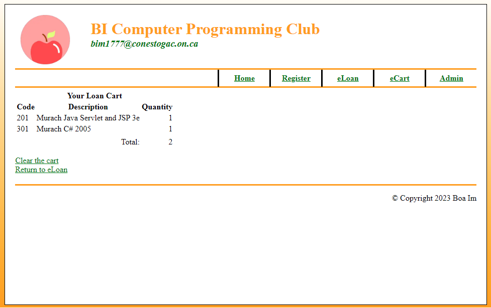
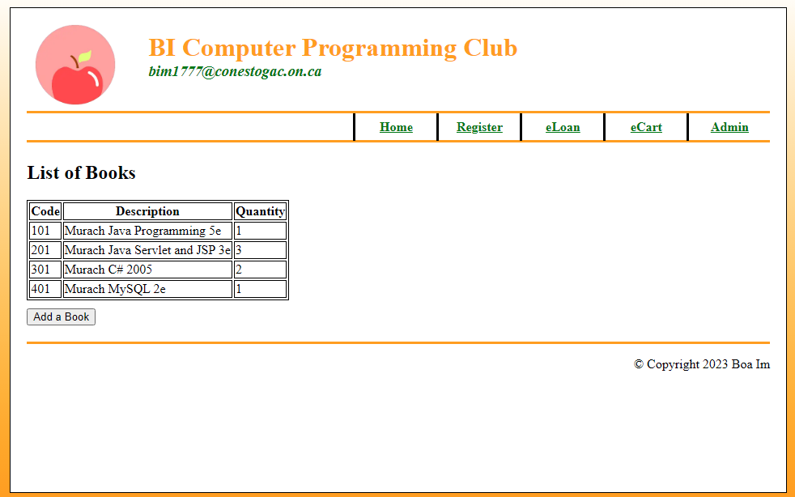
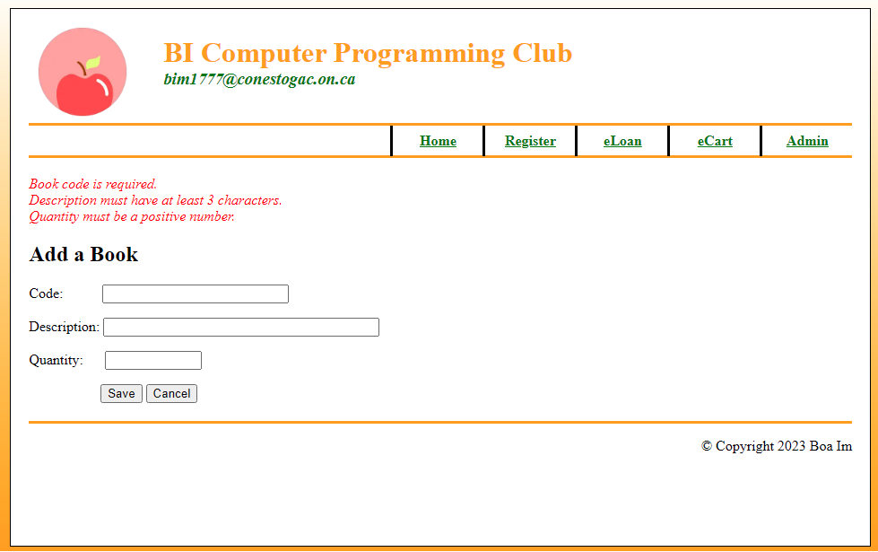

<h1>Computer Programming Club</h1>

This was made for an academic project of Java Web Technologies course at Conestogac College

<ul>
  <li>Build a <strong>JSP</strong> web app that allows users who are in IT programs of Conestoga College to register utilizing <strong>Tomcat Server</strong></li>
  <li>Add academic books to a list that will be updated to <strong>MySQL</strong using servlet by server-side validation and display them</li>
  <li>Go to error page if users enter characters in the quantity field to avoid 400 error</li>
</ul>

  <h4>1. Register Page</h4>
  
  
You can add a new member to database. Server-side validation works well

  <h4>2. After adding a new member</h4>
  
  
'Admin -> Display Member'. If you add a new member, you will see the member's information in that page via survlet
   You can edit or delete member by clicking the each button

  <h4>3. eLoan Page</h4>
  
  
You can loan books in eLoan Page

  <h4>4. eCart Page</h4>
  
  
You can see the books in your cart after adding a book to cart.
   This cart is made by your session. So, if your session is desployed, your cart will be refreshed

  <h4>5. List of Books Page</h4>
  
  
'Admin -> Manage Books'. You can see the books list that students can loan.

  <h4>6. Add a Book Page</h4>
  
  
You can add a new book to database.

